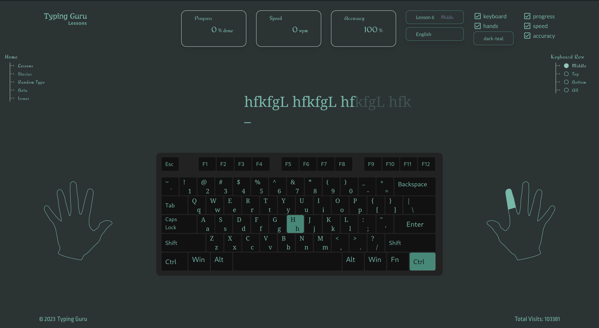

# Typing Guru [typing-guru.com](https://typing-guru.com)

Typing Guru is a web application that helps you to improve your typing skills. It is a free and open source project that you can use to practice typing in your browser.

## Features

-   Practice typing in your browser
-   Choose from different difficulty levels
-   Choose from different languages

## Built With

-   [NextJs](https://nextjs.org/)
-   [React](https://reactjs.org/)
-   [TypeScript](https://www.typescriptlang.org/)
-   [Tailwind CSS](https://tailwindcss.com/)
-   [Golang](https://golang.org/)

## Deployed With

-   [Netlify](https://www.netlify.com/)

## Contributing

Contributions are what make the open source community such an amazing place to be learn, inspire, and create. Any contributions you make are **greatly appreciated**.

1.  Fork the Project
2.  Create your Feature Branch (`git checkout -b feature/AmazingFeature`)
3.  Commit your Changes (`git commit -m 'Add some AmazingFeature'`)
4.  Push to the Branch (`git push origin feature/AmazingFeature`)
5.  Open a Pull Request

> Note: more details about contributing can be found in the [CONTRIBUTING.md](CONTRIBUTING.md) file.

## License

Distributed under the MIT License. See `LICENSE` for more information.
